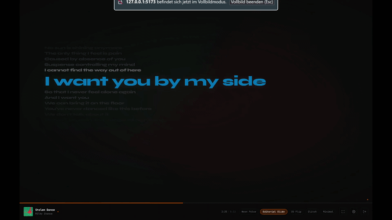

# Beattastic

**Lyrics in Motion.** Synchronized kinetic typography for your Spotify playback – live, in the browser, without uploading any audio.



[](https://vercel.com/new/clone?repository-url=https%3A%2F%2Fgithub.com%2Fonejanik%2Fbeattastic&env=VITE_SPOTIFY_CLIENT_ID,VITE_REDIRECT_URI&envDescription=Spotify%20Developer%20App%20credentials&envLink=https%3A%2F%2Fdeveloper.spotify.com%2Fdashboard)

---

## Schnellstart (5 Minuten)

### 1. Spotify Developer App erstellen

Jeder Nutzer braucht seine eigene kostenlose Spotify-App – kein Premium erforderlich.

1. → [developer.spotify.com/dashboard](https://developer.spotify.com/dashboard)
2. **Create app** → Name: „Beattastic", beliebige Beschreibung
3. **Redirect URI** eintragen:
   - Lokal: `http://127.0.0.1:5173/callback`
   - Deployed: `https://deine-domain.vercel.app/callback`
4. **Client ID** kopieren

> **Development Mode:** Neue Apps können bis zu **25 Nutzer** hinzufügen (Settings → User Management). Für öffentliche Apps ohne Limit → Extended Access bei Spotify beantragen.

### 2. Lokal starten

```bash
git clone https://github.com/onejanik/beattastic
cd beattastic
cp .env.example .env
# .env editieren: VITE_SPOTIFY_CLIENT_ID eintragen
npm install
npm run dev
```

→ [http://127.0.0.1:5173](http://127.0.0.1:5173)

---

## Deployment (empfohlen: Vercel)

### Option A – Ein-Klick mit Vercel

1. Repo auf GitHub pushen
2. Auf den **Deploy-Button** oben klicken
3. Environment Variables setzen:
   | Variable | Wert |
   |----------|------|
   | `VITE_SPOTIFY_CLIENT_ID` | Deine Spotify Client ID |
   | `VITE_REDIRECT_URI` | `https://deine-domain.vercel.app/callback` |
4. Nach dem Deploy die Production-URL als Redirect URI im Spotify Dashboard eintragen

### Option B – Manuell

```bash
npm run build          # erzeugt dist/
# dist/ auf beliebigem Static Host deployen (Vercel, Netlify, GitHub Pages, S3 …)
```

Die App ist ein reines **Static Bundle** – kein Server, keine Datenbank, keine Betriebskosten.

### Option C – Netlify

```bash
# Netlify CLI
npx netlify deploy --prod --dir=dist
```

---

## Spotify Extended Access (für öffentliche Apps)

Um die 25-Nutzer-Grenze aufzuheben:

1. Spotify Developer Dashboard → deine App → **Request Extended Access**
2. Use Case auswählen: **Music Discovery & Information**
3. Beschreibung: Beattastic visualisiert Lyrics synchron zur Spotify-Wiedergabe als Kinetic Typography
4. Demo-Link (deine deployed URL) + Screenshots beifügen
5. Warten auf Review (ca. 2–4 Wochen)

**Tipp:** Die eigene deployed Instanz teilen bevor Extended Access genehmigt ist – Nutzer können sich als Testnutzer im Dashboard eintragen lassen.

---

## Tastaturkürzel

| Taste | Aktion |
|-------|--------|
| `F` | Vollbild ein/aus |
| `1`–`5` | Preset wechseln |
| Mausbewegung | Ambient Mode beenden (UI einblenden) |

---

## Technologie

| Schicht | Bibliothek |
|---------|-----------|
| Framework | React 18 + TypeScript |
| Build | Vite 5 |
| Animation | Framer Motion 11 |
| Lyrics | [LRCLib](https://lrclib.net) (kostenlos, kein Key) |
| Farbe | Canvas-basierte Farbextraktion |
| Auth | Spotify OAuth 2.0 PKCE · Discord OAuth 2.0 |
| Bot | discord.js 14, Express, WebSocket (`ws`) |
| Fonts | Bebas Neue, Syne, JetBrains Mono |

---

## Features

- **5 Kinetic-Typography-Presets** – Neon Pulse, Editorial Slide, 3D Flip, Glitch, Minimal
- **Ambient Mode** – UI blendet sich nach 3,5s aus, perfekt als zweiter Bildschirm
- **Dynamische Album-Farbe** – Akzentfarbe wird automatisch aus dem Cover extrahiert
- **PWA** – als Desktop-App installierbar
- **Kein Audio-Upload** – liest nur den Playback-State vom aktiven Gerät

---

## Entstehung

Dieses Projekt wurde gemeinsam mit **[Cursor](https://cursor.com)** (KI-gestützter Code-Editor) entwickelt. Idee, Produktentscheidungen und Richtung kamen vom Entwickler – die KI hat bei Architektur, Implementierung und Debugging unterstützt.

Wir glauben, dass Transparenz hier wichtig ist: KI als Werkzeug, Mensch als Gestalter.

---

## Roadmap

- [ ] Video-Export (MP4 des aktuellen Presets)
- [ ] Screenshot-Funktion für Social Sharing
- [ ] Wort-für-Wort Karaoke (wenn LRCLib erweitert)
- [ ] Beat-Detection via Spotify Audio Features
- [ ] Eigene Preset-Templates erstellen und speichern
